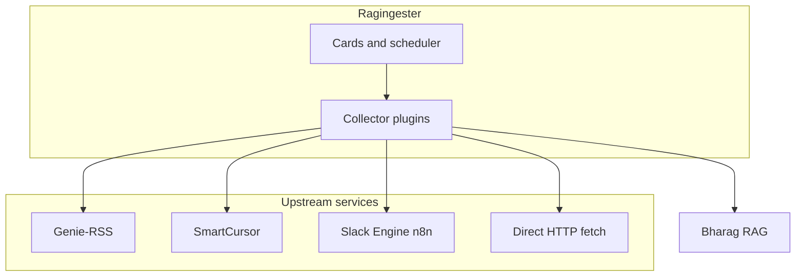
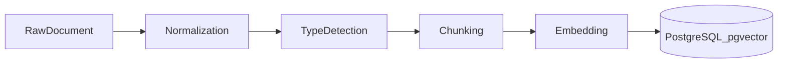
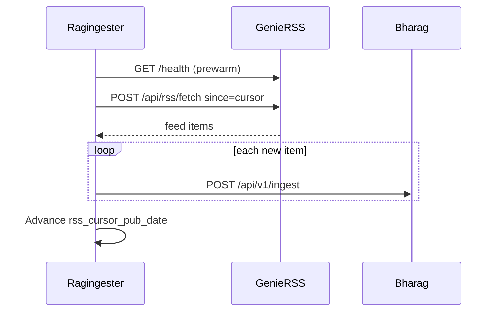
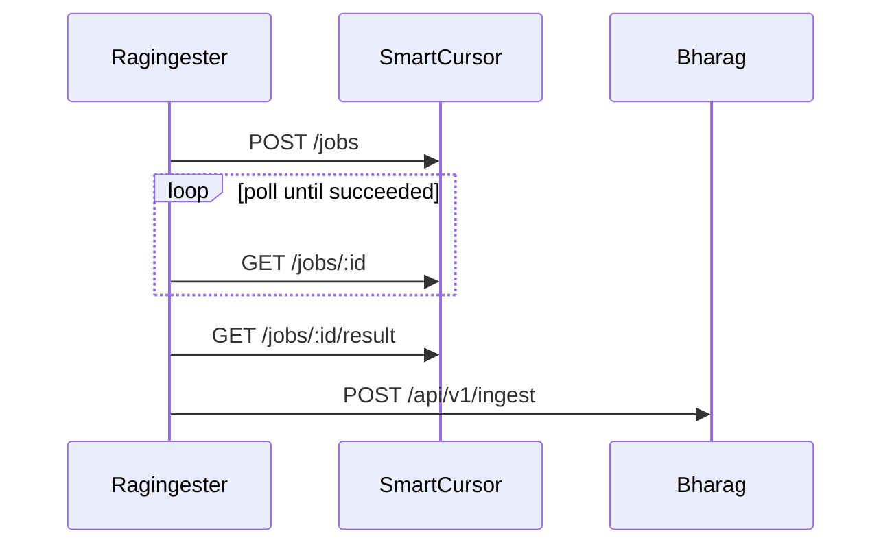

# Ragingester → Bharag Ingestion Stack

> **Source of truth:** This file lives in the ragingester repo. Import into Notion via **Import → Markdown**, then add dashboard links and access-control notes that should not live in git.
>
> **Builder handoff (LinkedIn / YouTube intel lane):** [linkedin-youtube-intel-handoff.md](./linkedin-youtube-intel-handoff.md)

**Last verified:** ragingester @ `3e5f3cc`

## Overview

Ragingester schedules **cards** by `source_type`, runs collector plugins on a cron or manual trigger, and (for production pipelines) ingests structured documents into **Bharag (BHA RAG)** workspaces for chunking, embedding, and semantic search.



### Source type matrix

| `source_type` | Upstream | Bharag workspace | Ingests to Bharag | Cursor / checkpoint |
|---------------|----------|----------------|-------------------|---------------------|
| `rss_feed` | Genie-RSS | `rss-feed` | Yes (per item) | `rss_cursor_pub_date` |
| `youtube` | Genie-RSS | `youtube-feed` | Yes (per video) | `youtube_cursor_pub_date` |
| `linkedin` | Genie-RSS | `linkedin-feed` | Yes (per post) | `linkedin_cursor_pub_date` |
| `smartcursor_link` | SmartCursor | `smartcursor-link` | Yes (per run) | `smartcursor_workspace_id` only |
| `slack_engine_fetch` | Slack Engine | `slack-engine-fetch` | Yes (per run) | `slack_engine_last_date` |
| `http_api` | Target URL | — | No | — |
| `website_url` | Target URL | — | No | — |
| `identifier_based` | — | — | No (placeholder) | — |

Collector implementations: [`apps/api/src/collectors/`](../apps/api/src/collectors/).

### Services

| Service | Production URL | Repo |
|---------|----------------|------|
| Ragingester | https://ragingester.onrender.com | this monorepo |
| Genie-RSS | https://genie-rss-5i00.onrender.com | [kaiqi-eng/Genie-RSS](https://github.com/kaiqi-eng/Genie-RSS) |
| Bharag (BHA RAG) | https://bharag.duckdns.org | [stacxio/bharag](https://github.com/stacxio/bharag) |
| SmartCursor | `SMARTCURSOR_BASE_URL` (per deploy) | — |
| Slack Engine | https://n8n.arupiautomates.com | — |

---

## Shared: Ragingester orchestration

### Card model

| Field | Purpose |
|-------|---------|
| `source_type` | Selects collector plugin |
| `source_input` | URL, channel name, or identifier (type-specific) |
| `schedule_enabled` / `cron_expression` / `timezone` | Scheduled runs |
| `params` | Cursors, workspace cache, per-card integration overrides |
| `active` | Must be true for scheduler pickup |
| `run_timeout_ms` / `run_max_retries` | Per-card run policy overrides |

### Scheduler

[`scheduler-tick.js`](../apps/api/src/lib/scheduler-tick.js) polls every `SCHEDULER_POLL_MS` (default 15s):

1. **Prewarm** — Only `rss_feed`: Genie `GET /health` when due within `RSS_PREWARM_WINDOW_MS` (2 min).
2. **Enqueue** — Due cards (`next_run_at <= now`) get scheduled runs (overlap-protected).
3. **Execute** — One claimed run per tick.

Prewarm markers (`rss_prewarm_for`, `rss_prewarmed_at`) are cleared on run completion ([`run-engine.js`](../apps/api/src/lib/run-engine.js)).

**Manual RSS runs** get a minimum 10-minute timeout (vs 3-minute default).

### Deployed topology

```text
node apps/api/src/server.js & node apps/api/src/scheduler/worker.js
```

See [`render.yaml`](../render.yaml).

### Shared Bharag workspace pattern

Production collectors that ingest to Bharag all follow the same workspace bootstrap:

1. Use cached `params.<type>_workspace_id` if present.
2. List workspaces; match by fixed slug.
3. `POST /api/v1/workspaces` if missing.
4. Ensure an owner builder (find/create builder, add member).

Auth: `x-api-key` + `x-workspace-id` on `POST /api/v1/ingest`.

### Shared per-card integration overrides

| Param key | Overrides env |
|-----------|---------------|
| `genie_rss_base_url` | `GENIE_RSS_BASE_URL` |
| `genie_rss_api_key` | `GENIE_RSS_API_KEY` |
| `bharag_base_url` | `BHARAG_BASE_URL` |
| `bharag_master_api_key` | `BHARAG_MASTER_API_KEY` |
| `smartcursor_base_url` | `SMARTCURSOR_BASE_URL` |
| `smartcursor_api_key` | `SMARTCURSOR_API_KEY` |
| `slack_engine_base_url` | `SLACK_ENGINE_BASE_URL` |
| `slack_engine_api_key` | `SLACK_ENGINE_API_KEY` |

### Cursor semantics (feed-based types)

Applies to `rss_feed`, `youtube`, `linkedin`:

- First run: no cursor → all items from upstream are candidates.
- Later runs: only items with `pubDate > cursor` are ingested (client-side filter; Genie also accepts `since`).
- Cursor advances to max `pubDate` among **successfully ingested** items only.
- Partial failure: run succeeds if at least one item ingests; fails only if all new items fail.

---

## Shared: Bharag (BHA RAG)

Bharag normalizes, chunks, embeds, and indexes ingested documents in PostgreSQL/pgvector.



| Stage | Default behavior |
|-------|------------------|
| Chunking | 1000 tokens/chunk, 200 overlap ([chunking.md](https://github.com/stacxio/bharag/blob/main/docs/rag-system/chunking.md)) |
| Embedding | `text-embedding-3-small`, 1536 dims ([embedding.md](https://github.com/stacxio/bharag/blob/main/docs/rag-system/embedding.md)) |
| Status | `pending` → `processing` → `indexed` |
| Query | `POST /api/v1/search`, Genie Slack bot ([search API](https://github.com/stacxio/bharag/blob/main/docs/api-reference/search.md)) |

Full pipeline: [Bharag ingestion docs](https://github.com/stacxio/bharag/blob/main/docs/rag-system/ingestion.md).

**Ingest response** (`201`): `{ success, document: { status: "indexed" }, chunks: { count }, stats: { embeddingTokens, latencyMs } }`.

---

## Shared: Genie-RSS

Used by `rss_feed`, `youtube`, and `linkedin`. Discovers or generates RSS, parses feeds, optional `since` filtering, in-memory cache (TTL 3600s).

Repo: [kaiqi-eng/Genie-RSS](https://github.com/kaiqi-eng/Genie-RSS)

| Method | Path | Auth | Used for |
|--------|------|------|----------|
| `GET` | `/health` | None | RSS prewarm |
| `POST` | `/api/rss/fetch` | `X-API-Key` | RSS, YouTube |
| `POST` | `/api/linkedin/profile-posts` | `X-API-Key` | LinkedIn profile mode |
| `POST` | `/api/linkedin/topic-posts` | `X-API-Key` | LinkedIn topic mode |

**`POST /api/rss/fetch`** body: `{ "url": "...", "since": "2026-04-20T00:00:00.000Z" }` (`since` optional).

Response: `{ source: "discovered"|"generated", feedUrl, feed: { items: [...] } }` with optional `_cache` metadata.

Swagger: `{GENIE_RSS_BASE_URL}/api-docs`

**Cold-start:** Render hosting; RSS pipeline prewarms 2 min before scheduled runs + 60s health retry at run start.

---

## Source type: `rss_feed`

**Collector:** [`rss-feed.js`](../apps/api/src/collectors/rss-feed.js)

| Property | Value |
|----------|-------|
| `source_input` | RSS feed URL or site URL |
| Bharag workspace | `rss-feed` / "RSS Feed" |
| `project_tags` | `["rss"]` |
| Cursor | `rss_cursor_pub_date` |
| Cached workspace | `rss_workspace_id` |
| Card validation | [`rss-source-check.js`](../apps/api/src/lib/rss-source-check.js) on create |
| Prewarm | Yes (scheduler + collector) |
| Genie endpoint | `POST /api/rss/fetch` |

### Flow



### Document content template

```text
TAGs: [RSS]
Timestamp ran: <run ISO>
Previous run: <cursor or none>
Post timestamp: <item pubDate>
Title: <title>
Content: <content>
Link: <link>
```

### Production feeds

18 feeds, Sunday stagger (`Europe/London`): [`cards-import-rss-weekly-sunday-staggered.csv`](../apps/api/cards-import-rss-weekly-sunday-staggered.csv)

Design rationale: [`STAGE_3_1_RSS_INGESTION_PLAN.md`](../STAGE_3_1_RSS_INGESTION_PLAN.md)

---

## Source type: `youtube`

**Collector:** [`youtube.js`](../apps/api/src/collectors/youtube.js)

| Property | Value |
|----------|-------|
| `source_input` | YouTube channel ID (`UC...`), channel URL, or feed URL |
| Bharag workspace | `youtube-feed` / "YouTube Feed" |
| `project_tags` | `["youtube"]` |
| Cursor | `youtube_cursor_pub_date` |
| Cached workspace | `youtube_workspace_id` |
| Prewarm | No |
| Genie endpoint | `POST /api/rss/fetch` (YouTube URL/channel resolved by Genie) |

### `source_input` normalization

Accepts:

- Raw channel ID: `UCxxxxxxxxxxxxxxxxxxxxxx`
- Feed URL: `https://www.youtube.com/feeds/videos.xml?channel_id=UC...`
- Channel URL: `https://www.youtube.com/channel/UC...`
- Other `https://` YouTube URLs (passed through to Genie)

### Document content template

```text
TAGs: [YOUTUBE]
Timestamp ran: ...
Previous run: ...
Post timestamp: ...
Title: ...
Content: ...
Link: ...
```

### Metadata

```json
{
  "ingestion_type": "youtube",
  "feed_source": "<normalized input>",
  "item_guid": "...",
  "item_pub_date": "..."
}
```

### Production channels

[`cards-import-youtube-weekly-sunday-staggered.csv`](../apps/api/cards-import-youtube-weekly-sunday-staggered.csv) and combined CSV with job names.

---

## Source type: `linkedin`

**Collector:** [`linkedin.js`](../apps/api/src/collectors/linkedin.js)

| Property | Value |
|----------|-------|
| Bharag workspace | `linkedin-feed` / "LinkedIn Feed" |
| `project_tags` | `["linkedin"]` |
| Cursor | `linkedin_cursor_pub_date` |
| Cached workspace | `linkedin_workspace_id` |
| Genie endpoints | Profile or topic (see below) |

### Modes (`params.linkedin_mode`)

**Profile** (default) — `source_input` = LinkedIn profile or company URL:

```json
{
  "linkedin_mode": "profile",
  "maxPosts": 10
}
```

Genie: `POST /api/linkedin/profile-posts` with `{ profileUrl, maxPosts }`.

**Topic** — keyword search:

```json
{
  "linkedin_mode": "topic",
  "searchQueries": ["b2b sales", "revenue operations"],
  "authorsCompanies": ["Microsoft"],
  "contentType": "posts",
  "maxPosts": 20,
  "maxReactions": 5,
  "scrapeComments": false,
  "scrapeReactions": false
}
```

If `searchQueries` omitted, `source_input` is split on commas. Genie: `POST /api/linkedin/topic-posts`.

### Document content template

```text
TAGs: [LINKEDIN]
Timestamp ran: ...
Previous run: ...
Post timestamp: ...
Title: ...
Author: ...
Reactions: ...
Content: ...
Link: ...
```

### Metadata

Includes `linkedin_mode`, `feed_source`, `item_guid`, `item_pub_date`, plus LinkedIn fields from Genie (`author`, `reactions`, etc.).

---

## Source type: `smartcursor_link`

**Collector:** [`smartcursor-link.js`](../apps/api/src/collectors/smartcursor-link.js)

Browser automation: SmartCursor navigates a URL (optionally logs in), extracts content, ingests one Bharag document per run.

| Property | Value |
|----------|-------|
| `source_input` | Target page URL |
| Bharag workspace | `smartcursor-link` / "SmartCursor Link" |
| `project_tags` | `["smartcursor", "browser"]` |
| Cursor | None (full capture each run) |
| Cached workspace | `smartcursor_workspace_id` |
| Requires | `SMARTCURSOR_BASE_URL`, `SMARTCURSOR_API_KEY`, `BHARAG_MASTER_API_KEY` |

### Flow



- Job timeout: 4 minutes (poll every 3s).
- Extracted text from `result.rawText` or `result.parsedPosts`.

### Key `params`

| Param | Purpose |
|-------|---------|
| `goal` | Agent goal (default: extract readable content) |
| `max_steps` | Max browser steps (default 20) |
| `auth.login_fields` | `{ name, selector, value, secret? }[]` for login |
| `extraction_schema` | JSON schema for structured extraction |

Example: [`docs/adding-new-source-types.md`](adding-new-source-types.md#smartcursor_link-params-example-misclogin-links).

### Metadata

```json
{
  "ingestion_type": "smartcursor_link",
  "job_id": "...",
  "final_url": "...",
  "auth_mode": "login_fields" | "none"
}
```

---

## Source type: `slack_engine_fetch`

**Collector:** [`slack-engine-fetch.js`](../apps/api/src/collectors/slack-engine-fetch.js)

Fetches **previous calendar day's** Slack channel messages via n8n Slack Engine webhook, ingests one document per run.

| Property | Value |
|----------|-------|
| `source_input` | Slack **channel name** (e.g. `general`) |
| Bharag workspace | `slack-engine-fetch` / "Slack Engine Fetch" |
| `project_tags` | `["slack", "daily-capture"]` |
| Checkpoint | `slack_engine_last_date` |
| Cached workspace | `slack_engine_workspace_id` |
| Default upstream | `https://n8n.arupiautomates.com` |

### Flow

1. Compute `fetchDate` = previous day in card `timezone` (default `America/Chicago`).
2. `GET {SLACK_ENGINE_BASE_URL}/webhook/slack-engine/fetch?channel={name}&date={YYYY-MM-DD}` with `x-api-key`.
3. Ingest `response.content` as one document.

### Document title

`Slack daily capture: #{channel} ({date})`

### Metadata

```json
{
  "ingestion_type": "slack_engine_fetch",
  "channel_name": "...",
  "channel_id": "...",
  "date": "YYYY-MM-DD",
  "doc_url": "..."
}
```

---

## Source type: `http_api`

**Collector:** [`http-api.js`](../apps/api/src/collectors/http-api.js)

**Reference / utility collector** — does not ingest to Bharag.

| Property | Value |
|----------|-------|
| `source_input` | Request URL |
| `params.method` | HTTP method (default `GET`) |
| `params.headers` | Request headers object |
| `params.body` | JSON body (for POST/PUT) |

Returns `raw` response body and `normalized.status` / `normalized.payload`.

---

## Source type: `website_url`

**Collector:** [`website-url.js`](../apps/api/src/collectors/website-url.js)

**Reference / utility collector** — does not ingest to Bharag.

| Property | Value |
|----------|-------|
| `source_input` | Page URL |

Fetches HTML; returns title (regex from `<title>`), `content_length`, status.

---

## Source type: `identifier_based`

**Collector:** [`identifier-based.js`](../apps/api/src/collectors/identifier-based.js)

**Placeholder collector** — does not call external services or Bharag.

Returns synthetic `normalized.resolved: true` with the identifier echoed. Intended as a scaffold for custom identifier resolution.

---

## Configuration

### Ragingester environment variables

| Variable | Default | Used by |
|----------|---------|---------|
| `GENIE_RSS_BASE_URL` | `https://genie-rss-5i00.onrender.com` | rss, youtube, linkedin |
| `GENIE_RSS_API_KEY` | *(secret)* | Genie auth |
| `BHARAG_BASE_URL` | `https://bharag.duckdns.org` | All Bharag ingestors |
| `BHARAG_MASTER_API_KEY` | *(secret)* | Bharag admin API |
| `BHARAG_OWNER_BUILDER_ID` | — | Workspace owner bootstrap |
| `BHARAG_OWNER_NAME` | `Ragingester RSS Owner` | Builder name |
| `BHARAG_OWNER_EMAIL` | — | Builder email |
| `SMARTCURSOR_BASE_URL` | — | smartcursor_link |
| `SMARTCURSOR_API_KEY` | *(secret)* | smartcursor_link |
| `SLACK_ENGINE_BASE_URL` | `https://n8n.arupiautomates.com` | slack_engine_fetch |
| `SLACK_ENGINE_API_KEY` | *(secret)* | slack_engine_fetch |
| `RSS_PREWARM_WINDOW_MS` | `120000` | rss_feed prewarm |
| `RUN_TIMEOUT_MS` | `180000` | Run timeout |
| `RUN_MAX_RETRIES` | `1` | Run retries |
| `SCHEDULER_POLL_MS` | `15000` | Scheduler interval |

Secrets: Render env only — **do not copy into Notion**.

### Access control (Notion only)

- API key ownership and rotation
- Bharag workspace admin membership
- SmartCursor / Slack Engine credentials

---

## Operations runbook

### Add a production ingestor card

| Type | Steps |
|------|-------|
| RSS | UI or [`cards-import-rss-weekly-sunday-staggered.csv`](../apps/api/cards-import-rss-weekly-sunday-staggered.csv) |
| YouTube | UI or [`cards-import-youtube-weekly-sunday-staggered.csv`](../apps/api/cards-import-youtube-weekly-sunday-staggered.csv) |
| LinkedIn | Create card with profile URL or topic `params` |
| SmartCursor | Set URL + `goal` / `auth` in `params` |
| Slack | Set `source_input` = channel name; schedule daily |

Combined import with job names: [`cards-import-combined-weekly-sunday-staggered-with-job-names.csv`](../apps/api/cards-import-combined-weekly-sunday-staggered-with-job-names.csv)

### Verify any Bharag ingestor run

1. Run history → `ingested_count` / `failed_count` (or `ingested: 1` for single-doc types).
2. Check cursor/checkpoint param advanced (feed types).
3. Bharag workspace for that `source_type` slug → documents `status: indexed`.

### Debug by symptom

| Symptom | Likely cause |
|---------|--------------|
| RSS timeout | Genie cold start; check prewarm; manual run (10 min) |
| Genie 429 | Rate limit; RSS collector retries with backoff |
| `fetched > 0`, `ingested = 0` | Cursor ahead of items |
| SmartCursor job failed | Login selectors, site change, job timeout |
| Slack empty content | No messages previous day in channel |
| Bharag 4xx/5xx | Master key, workspace, or owner member |

### Smoke tests

```bash
# Genie health
curl -s -H "X-API-Key: REDACTED" https://genie-rss-5i00.onrender.com/health

# Genie RSS fetch
curl -s -X POST https://genie-rss-5i00.onrender.com/api/rss/fetch \
  -H "Content-Type: application/json" -H "X-API-Key: REDACTED" \
  -d '{"url":"https://techcrunch.com/feed/"}'

# Bharag workspaces
curl -s -H "x-api-key: REDACTED" \
  "https://bharag.duckdns.org/api/v1/workspaces?limit=100&offset=0"
```

---

## Bharag workspace map

| Workspace slug | Source types | `project_tags` |
|----------------|--------------|----------------|
| `rss-feed` | `rss_feed` | `rss` |
| `youtube-feed` | `youtube` | `youtube` |
| `linkedin-feed` | `linkedin` | `linkedin` |
| `smartcursor-link` | `smartcursor_link` | `smartcursor`, `browser` |
| `slack-engine-fetch` | `slack_engine_fetch` | `slack`, `daily-capture` |

Query/filter by workspace slug or `project_tags` when searching ingested content in Bharag.

---

## Appendix

### Adding a new source type

See [`adding-new-source-types.md`](adding-new-source-types.md).

### Importing into Notion

1. **Import** this file as Markdown.
2. Suggested path: `Engineering / Data Pipelines / Ragingester Ingestion`.
3. Post-import: pin the overview diagram; use toggles for API payloads; add callouts for secrets and cold-start; link Render/Bharag/UIs.
4. Optional: **Feed Inventory** database from production CSV tables.

### External references

- [Genie-RSS](https://github.com/kaiqi-eng/Genie-RSS)
- [Bharag ingestion](https://github.com/stacxio/bharag/blob/main/docs/rag-system/ingestion.md)
- [Bharag architecture](https://github.com/stacxio/bharag/blob/main/BHA_RAG_Knowledge_Base_Architecture.md)
