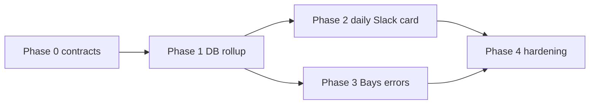

# Multi-Phase Plan: Logging & Telemetry (RSS Daily Status + Pipeline Errors)

**Status:** Phase 0 done · Phase 1+ planned  
**Owner:** ragingester (Kaiqi) · contract from Jason Bays / monitoring twin  
**Last updated:** 2026-07-27

## Goal

Ship observability in the agreed dual-channel style:

1. **Daily status card** — structured JSON + Slack Block Kit rollup (healthy + degraded + failed).
2. **Pipeline errors** — reuse the existing Bays Error Handler path into `#bha-pipeline-errors` + `engine_errors` sheet (do not invent a second error format).

Research Twin (and later vFarm Monitoring Twin) will consume the same status channel; `system` + `run_id` are how status cards join to matching error posts.

## Locked decisions (from schema review)

| Decision | Choice |
|----------|--------|
| `system` | `"genie_rss"` (subsystem tag for the card; Genie-RSS remains the fetch dependency) |
| `failures[].feed` | Card `source_input` (URL). No display-name field exists on cards. |
| `failures[].code` | Current free-text failure message (`error.message` / `run.error`). Not a native short taxonomy. |
| `ingest.degraded` | Derive: run `status=success` **and** (`metrics.failed > 0` or `normalized.failed_count > 0`) |
| `ingest.ok` | Run `status=success` and not degraded |
| `ingest.failed` | Run `status=failed` |
| Daily card vs Bays | Status card = rollup. Immediate / classified failures = Bays 5-class path. |
| Do not invent | Second error taxonomy, second Slack error template, or a separate RSS-only error pipeline |

## Target contracts

### 1. RSS Daily Status schema

```json
{
  "system": "genie_rss",
  "run_id": "<stable id for cross-system correlation>",
  "date": "YYYY-MM-DD",
  "feeds_active": 0,
  "ingest": { "ok": 0, "degraded": 0, "failed": 0 },
  "last_run": "<ISO 8601 timestamp>",
  "failures": [
    {
      "feed": "<source_input URL>",
      "code": "<error.message text>",
      "count": 0,
      "first_seen": "<ISO timestamp or null>"
    }
  ],
  "link": "<run id or log pointer>"
}
```

### 2. Slack Block Kit (daily card)

```json
{
  "blocks": [
    {
      "type": "header",
      "text": { "type": "plain_text", "text": "RSS Daily Status, {{date}}" }
    },
    {
      "type": "section",
      "fields": [
        { "type": "mrkdwn", "text": "*Feeds active:*\n{{feeds_active}}" },
        {
          "type": "mrkdwn",
          "text": "*Ingest:*\nOK {{ingest.ok}} | Degraded {{ingest.degraded}} | Failed {{ingest.failed}}"
        }
      ]
    },
    {
      "type": "context",
      "elements": [{ "type": "mrkdwn", "text": "Last run: {{last_run}}" }]
    },
    { "type": "divider" },
    {
      "type": "section",
      "text": {
        "type": "mrkdwn",
        "text": "*Failures:*\n{{#each failures}}• `{{feed}}`, {{code}}, {{count}} ({{first_seen}})\n{{/each}}"
      }
    },
    {
      "type": "context",
      "elements": [{ "type": "mrkdwn", "text": "Full run log: {{link}}" }]
    }
  ]
}
```

Truncate long `code` strings for Slack (keep full text in the structured payload / logs).

### 3. Bays Error Handler fields (reuse as-is)

| Field | RSS mapping |
|-------|-------------|
| `workflow_name` | `"Genie_RSS"` (document: means ragingester RSS lane, not Genie service outages only) |
| `failed_node` | Feed URL (`source_input`) |
| `error_class` | Bays taxonomy: `billing_quota` \| `network_timeout` \| `schema_validation` \| `config_auth` \| `unknown` |
| `error_message` | Free-text from ragingester |
| `execution_id` | Prefer daily `run_id` when correlating to a status card; else per-run `collection_runs.id` |
| `timestamp` | ISO failure time |
| `auto_action` | Per Bays handler defaults |

Post to `#bha-pipeline-errors` and log to the same `engine_errors` sheet tab.

## Baseline (today)

| Capability | Current state |
|------------|---------------|
| Per-run DB | `collection_runs` with `success` / `failed`, `error`, `error_payload`, `logs` |
| RSS metrics | Per-run item counts: `fetched`, `selected`, `ingested`, `failed` |
| Slack alerts | Optional plain-text **Daily Failure Digest** only (`ALERTS_ENABLED` default `false`) |
| Block Kit / status card | None |
| Fleet `run_id` | None (only per-card run UUIDs) |
| Bays / `#bha-pipeline-errors` / `engine_errors` | None in this repo |
| Friendly feed name | None (URL only) |

Relevant code:

- `apps/api/src/services/alerts/` — digest queue + Slack text
- `apps/api/src/lib/run-engine.js` — run lifecycle + `recordFailureAlert`
- `apps/api/src/collectors/rss-feed.js` — item metrics / partial failure behavior
- `apps/api/src/config.js` — alert env knobs

---

## Phase 0 — Contracts & fixtures (no prod Slack)

**Status:** done (2026-07-27)  
**Contracts doc:** [telemetry-contracts.md](./telemetry-contracts.md)  
**Module:** [`apps/api/src/telemetry/`](../apps/api/src/telemetry/)

**Outcome:** Shared types + golden fixtures so status and error emitters cannot drift.

### Work

1. Add a small contract module (e.g. `packages/shared` or `apps/api/src/telemetry/`):
   - `RssDailyStatus` shape validators / JSDoc
   - `degraded` classification helper
   - Slack Block Kit builder from status object
   - Failure grouping: key by `(feed, code)` → `{ count, first_seen }`
2. Document env / channel targets (status channel vs `#bha-pipeline-errors`).
3. Golden fixtures:
   - All-ok day
   - Mixed ok / degraded / failed
   - Empty failures list
   - Long error message truncation for Block Kit

### Exit criteria

- [x] Unit tests for classify + group + Block Kit render
- [x] Fixture JSON committed and reviewed against Jason’s schema
- [x] ADR note: `code` = free-text message; Bays class is separate

### Non-goals

- No Slack posts, no Bays calls, no scheduler changes

---

## Phase 1 — Persist enough to build a real daily rollup

**Outcome:** A day’s RSS runs can be queried and mapped into the status schema without relying on in-memory alert maps.

### Work

1. Define the aggregation window (recommend **UTC day**, matching today’s digest day key).
2. Query path over active `rss_feed` cards + that day’s `collection_runs` (+ `collected_data.metadata.metrics` when present).
3. Implement mapper → `RssDailyStatus`:
   - `feeds_active` = count of active `rss_feed` cards
   - `ingest.*` via locked degraded rule
   - `failures[]` from failed runs; `feed` = `source_input`; `code` = message; group + `first_seen`
   - `last_run` = max `ended_at` / `last_run_at` in window
   - `run_id` = mint stable daily id (e.g. `genie_rss:{date}` or UUID stored once per day)
   - `link` = run UUID list, dashboard deep-link, or primary failed run id (pick one; document it)
4. Optional: persist daily status JSON (table or object store) so twins can pull without Slack.

### Exit criteria

- [ ] Dry-run CLI or admin endpoint returns schema-valid JSON for a real day
- [ ] Degraded runs appear in `ingest.degraded`, not only in `failures`
- [ ] Restart-safe (DB-backed), unlike today’s in-memory digest

### Non-goals

- No Block Kit post yet; keep existing digest behavior until Phase 2 cuts over

---

## Phase 2 — Emit daily status card (Slack Block Kit)

**Outcome:** One structured daily card replaces (or supersedes) the plain-text failure-only digest for RSS.

### Work

1. Scheduler hook: after UTC day rolls (same flush cadence as `flushDailyFailureAlerts`, or a dedicated daily job).
2. Build status → Block Kit → post to the **status** channel (config separate from pipeline-errors).
3. Also attach/log the raw JSON payload (thread, file, or twin webhook) so Research Twin does not scrape Slack mrkdwn.
4. Feature flag: e.g. `TELEMETRY_DAILY_STATUS_ENABLED` (default off until smoke-tested).
5. Migrate off RSS-relevant plain-text digest once status card is trusted (keep digest for non-RSS sources if needed, or generalize later).

### Config (illustrative)

| Env | Purpose |
|-----|---------|
| `TELEMETRY_DAILY_STATUS_ENABLED` | Gate daily card |
| `TELEMETRY_STATUS_SLACK_CHANNEL_ID` / webhook | Status channel (not pipeline-errors) |
| Existing `ALERTS_*` / `SLACK_*` | Interim digest / bot transport reuse where safe |

### Exit criteria

- [ ] Card posts for a known day with correct ok/degraded/failed counts
- [ ] Structured JSON available alongside Block Kit
- [ ] Flag-off leaves production behavior unchanged

---

## Phase 3 — Pipeline errors via Bays (reuse existing handler)

**Outcome:** Terminal RSS failures classify and post through the Bays Error Handler — same 5-class taxonomy, same Slack template, same `engine_errors` sheet.

### Work

1. On exhausted retries for `source_type=rss_feed`, emit a Bays-compatible event:
   - `workflow_name: "Genie_RSS"`
   - `failed_node: source_input`
   - `error_message: message`
   - `execution_id: daily run_id` when known, else `collection_runs.id`
   - `timestamp`
2. Hand off to classification step (call existing Bays handler / shared classifier — do not fork taxonomy).
3. Ensure `error_class` + `auto_action` come from Bays, not ragingester inventing classes.
4. Include `run_id` (daily) in payload or message metadata so twins can join status ↔ error posts.
5. Expand alert event to always carry `source_input` (today’s alert card object omits feed URL).

### Exit criteria

- [ ] Forced RSS failure appears in `#bha-pipeline-errors` in Bays format
- [ ] Row appears on `engine_errors` sheet
- [ ] `execution_id` / `run_id` joinable to that day’s status card
- [ ] No duplicate RSS-only error channel

### Open dependency

- Confirm integration point with Jason: webhook URL, shared package, or n8n/Bays workflow trigger ragingester should call.

---

## Phase 4 — Telemetry hardening

**Outcome:** Operable, observable, twin-ready.

### Work

1. Structured internal logs on emit paths: status built, Slack ok/fail, Bays ok/fail (never swallow without a log line).
2. Idempotency: one status card per `(system, date)`; safe re-flush.
3. Retention: how long daily status JSON is kept; how `link` resolves historically.
4. Metrics counters (optional): `telemetry.status_posted`, `telemetry.bays_posted`, `telemetry.bays_failed`.
5. Docs: update `docs/ingestion-stack.md` + this plan’s “done” checklist; note `Genie_RSS` naming mapping.
6. (Optional stretch) Extend same pattern to `youtube` / `linkedin` with distinct `system` tags.

### Exit criteria

- [ ] Re-run of flush does not double-post
- [ ] Failed Slack/Bays delivery is logged with enough fields to debug
- [ ] Twin consumer can join status `run_id` ↔ error `execution_id` on a sample day

---

## Suggested sequencing



Phases 2 and 3 can proceed in parallel after Phase 1, as long as both use the same `run_id` minting rule.

## Out of scope (for this plan)

- Friendly feed display names (would need a new card field)
- Replacing Bays taxonomy with ragingester-local classes
- Full multi-source unified monitoring twin UI
- Changing Bharag ingest document shape

## Test plan (cross-cutting)

| Layer | Coverage |
|-------|----------|
| Unit | classify ok/degraded/failed; group failures; Block Kit builder; message truncation |
| Integration | Aggregate a seeded day of runs → schema-valid status |
| Smoke | Flag-on post to a staging Slack channel; forced failure → Bays path |
| Twin join | One day with both status card + error post sharing `run_id` / `execution_id` |

## Open questions (resolve before Phase 3 / twin load-bearing)

1. Exact status Slack channel vs `#bha-pipeline-errors`.
2. Bays handoff mechanism (HTTP? shared module? existing n8n webhook?).
3. Canonical `link` format for humans and twins.
4. Whether `execution_id` for Bays is always the daily `run_id` or the per-feed run UUID (recommend: daily `run_id` in a dedicated correlation field if Bays `execution_id` must stay per-run).
