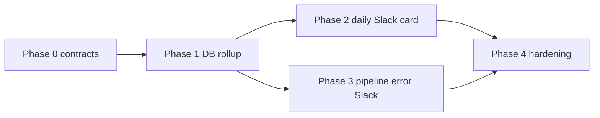

# Multi-Phase Plan: Logging & Telemetry (RSS Daily Status + Pipeline Errors)

**Status:** Phase 0–3 done · Phase 4 planned  
**Owner:** ragingester (Kaiqi) · contract from Jason Bays / monitoring twin  
**Last updated:** 2026-07-30

## Goal

Ship observability in the agreed dual-channel style:

1. **Daily status card** — structured JSON + Slack Block Kit rollup (healthy + degraded + failed).
2. **Pipeline errors** — post a **Bays-shaped** Slack Block Kit message directly into `#bha-pipeline-errors` (same visual layout as existing Bays failure posts). Do **not** call the Bays Error Handler.

Research Twin (and later vFarm Monitoring Twin) will consume the same status channel; `system` + `run_id` are how status cards join to matching error posts.

## Locked decisions (from schema review)

| Decision | Choice |
|----------|--------|
| `system` | `"genie_rss"` (subsystem tag for the card; Genie-RSS remains the fetch dependency) |
| `failures[].feed` | Card `source_input` (URL). No display-name field exists on cards. |
| `failures[].code` | Current free-text failure message (`error.message` / `run.error`). Not a native short taxonomy. |
| `ingest.degraded` | Derive: run `status=success` **and** (`metrics.failed > 0` or `normalized.failed_count > 0`) |
| `ingest.ok` | Run `status=success` and not degraded |
| `ingest.failed` | Run `status=failed` |
| Daily card vs Bays | Status card = rollup. Immediate / classified failures = Bays 5-class path. |
| Do not invent | Second error taxonomy, second Slack error template, or a separate RSS-only error pipeline |

## Target contracts

### 1. RSS Daily Status schema

```json
{
  "system": "genie_rss",
  "run_id": "<stable id for cross-system correlation>",
  "date": "YYYY-MM-DD",
  "feeds_active": 0,
  "ingest": { "ok": 0, "degraded": 0, "failed": 0 },
  "last_run": "<ISO 8601 timestamp>",
  "failures": [
    {
      "feed": "<source_input URL>",
      "code": "<error.message text>",
      "count": 0,
      "first_seen": "<ISO timestamp or null>"
    }
  ],
  "link": "<run id or log pointer>"
}
```

### 2. Slack Block Kit (daily card)

```json
{
  "blocks": [
    {
      "type": "header",
      "text": { "type": "plain_text", "text": "RSS Daily Status, {{date}}" }
    },
    {
      "type": "section",
      "fields": [
        { "type": "mrkdwn", "text": "*Feeds active:*\n{{feeds_active}}" },
        {
          "type": "mrkdwn",
          "text": "*Ingest:*\nOK {{ingest.ok}} | Degraded {{ingest.degraded}} | Failed {{ingest.failed}}"
        }
      ]
    },
    {
      "type": "context",
      "elements": [{ "type": "mrkdwn", "text": "Last run: {{last_run}}" }]
    },
    { "type": "divider" },
    {
      "type": "section",
      "text": {
        "type": "mrkdwn",
        "text": "*Failures:*\n{{#each failures}}• `{{feed}}`, {{code}}, {{count}} ({{first_seen}})\n{{/each}}"
      }
    },
    {
      "type": "context",
      "elements": [{ "type": "mrkdwn", "text": "Full run log: {{link}}" }]
    }
  ]
}
```

Truncate long `code` strings for Slack (keep full text in the structured payload / logs).

### 3. Pipeline-error Slack shape (Bays-lookalike, no Bays call)

Post **directly** to `#bha-pipeline-errors` as Block Kit matching existing Bays failure posts:

| Line | RSS mapping |
|------|-------------|
| Title | `Bays — Pipeline Failure` |
| Workflow | `Genie_RSS` |
| Failed Node | Feed URL (`source_input`) |
| Error Class | Local map → `BILLING/QUOTA` \| `NETWORK/TIMEOUT` \| `SCHEMA/VALIDATION` \| `CONFIG/AUTH` \| `UNKNOWN` |
| Error | Free-text from ragingester |
| Execution ID | Prefer daily `run_id`; else per-run `collection_runs.id` |
| Time | Human-readable failure time |
| Auto-Action | Local static guidance for the class |
| Mention | Configurable |

Do **not** invoke the Bays Error Handler or write via Bays to `engine_errors`.

## Baseline (today)

| Capability | Current state |
|------------|---------------|
| Per-run DB | `collection_runs` with `success` / `failed`, `error`, `error_payload`, `logs` |
| RSS metrics | Per-run item counts: `fetched`, `selected`, `ingested`, `failed` |
| Slack alerts | Optional plain-text **Daily Failure Digest** only (`ALERTS_ENABLED` default `false`) |
| Block Kit / status card | None |
| Fleet `run_id` | None (only per-card run UUIDs) |
| Bays / `#bha-pipeline-errors` / `engine_errors` | None in this repo |
| Friendly feed name | None (URL only) |

Relevant code:

- `apps/api/src/services/alerts/` — digest queue + Slack text
- `apps/api/src/lib/run-engine.js` — run lifecycle + `recordFailureAlert`
- `apps/api/src/collectors/rss-feed.js` — item metrics / partial failure behavior
- `apps/api/src/config.js` — alert env knobs

---

## Phase 0 — Contracts & fixtures (no prod Slack)

**Status:** done (2026-07-27)  
**Contracts doc:** [telemetry-contracts.md](./telemetry-contracts.md)  
**Module:** [`apps/api/src/telemetry/`](../apps/api/src/telemetry/)

**Outcome:** Shared types + golden fixtures so status and error emitters cannot drift.

### Work

1. Add a small contract module (e.g. `packages/shared` or `apps/api/src/telemetry/`):
   - `RssDailyStatus` shape validators / JSDoc
   - `degraded` classification helper
   - Slack Block Kit builder from status object
   - Failure grouping: key by `(feed, code)` → `{ count, first_seen }`
2. Document env / channel targets (status channel vs `#bha-pipeline-errors`).
3. Golden fixtures:
   - All-ok day
   - Mixed ok / degraded / failed
   - Empty failures list
   - Long error message truncation for Block Kit

### Exit criteria

- [x] Unit tests for classify + group + Block Kit render
- [x] Fixture JSON committed and reviewed against Jason’s schema
- [x] ADR note: `code` = free-text message; Bays class is separate

### Non-goals

- No Slack posts, no Bays calls, no scheduler changes

---

## Phase 1 — Persist enough to build a real daily rollup

**Status:** done (2026-07-28)  
**Contracts:** [telemetry-contracts.md](./telemetry-contracts.md)  
**Builder:** [`apps/api/src/telemetry/build-daily-status.js`](../apps/api/src/telemetry/build-daily-status.js)  
**Dry-run:** `GET /telemetry/rss-daily-status?date=YYYY-MM-DD`

**Outcome:** A day’s RSS runs can be queried and mapped into the status schema without relying on in-memory alert maps.

### Work

1. Define the aggregation window (recommend **UTC day**, matching today’s digest day key).
2. Query path over active `rss_feed` cards + that day’s `collection_runs` (+ `collected_data.metadata.metrics` when present).
3. Implement mapper → `RssDailyStatus`:
   - `feeds_active` = count of active `rss_feed` cards
   - `ingest.*` via locked degraded rule
   - `failures[]` from failed runs; `feed` = `source_input`; `code` = message; group + `first_seen`
   - `last_run` = max `ended_at` / `last_run_at` in window
   - `run_id` = mint stable daily id (e.g. `genie_rss:{date}` or UUID stored once per day)
   - `link` = run UUID list, dashboard deep-link, or primary failed run id (pick one; document it)
4. Optional: persist daily status JSON (table or object store) so twins can pull without Slack.

### Exit criteria

- [x] Dry-run CLI or admin endpoint returns schema-valid JSON for a real day
- [x] Degraded runs appear in `ingest.degraded`, not only in `failures`
- [x] Restart-safe (DB-backed), unlike today’s in-memory digest

### Non-goals

- No Block Kit post yet; keep existing digest behavior until Phase 2 cuts over

---

## Phase 2 — Emit daily status card (Slack Block Kit)

**Status:** done (2026-07-29)  
**Contracts:** [telemetry-contracts.md](./telemetry-contracts.md)  
**Flush:** [`apps/api/src/telemetry/flush-daily-status.js`](../apps/api/src/telemetry/flush-daily-status.js)  
**Manual emit:** `POST /telemetry/rss-daily-status/emit?date=YYYY-MM-DD`

**Outcome:** One structured daily card posts to the status channel (additive; plain-text digest unchanged). Pipeline errors / Bays are out of scope for this path.

### Work

1. Scheduler hook: after UTC day rolls (same flush cadence as `flushDailyFailureAlerts`, or a dedicated daily job).
2. Build status → Block Kit → post to the **status** channel (config separate from pipeline-errors).
3. Also attach/log the raw JSON payload (thread, file, or twin webhook) so Research Twin does not scrape Slack mrkdwn.
4. Feature flag: e.g. `TELEMETRY_DAILY_STATUS_ENABLED` (default off until smoke-tested).
5. Migrate off RSS-relevant plain-text digest once status card is trusted (keep digest for non-RSS sources if needed, or generalize later).

### Config

| Env | Purpose |
|-----|---------|
| `TELEMETRY_DAILY_STATUS_ENABLED` | Gate daily card (default false) |
| `TELEMETRY_STATUS_SLACK_CHANNEL_ID` | Status channel for bot path |
| `TELEMETRY_STATUS_SLACK_WEBHOOK_URL` | Preferred status webhook |
| `SLACK_BOT_TOKEN` | Bot path token |
| Existing `ALERTS_*` / digest `SLACK_*` | Unchanged digest |

### Exit criteria

- [x] Card posts for a known day with correct ok/degraded/failed counts
- [x] Structured JSON available alongside Block Kit
- [x] Flag-off leaves production behavior unchanged

---

## Phase 3 — Pipeline errors → `#bha-pipeline-errors` (Bays-shaped Slack, no Bays call)

**Status:** done (2026-07-30)  
**Emit:** [`apps/api/src/telemetry/emit-pipeline-error.js`](../apps/api/src/telemetry/emit-pipeline-error.js)  
**Contracts:** [telemetry-contracts.md](./telemetry-contracts.md)

**Outcome:** On terminal RSS run failures, ragingester posts a Slack message **directly** into `#bha-pipeline-errors` that matches the existing Bays pipeline-failure **shape**. Do **not** invoke the Bays Error Handler, n8n Bays workflow, or shared Bays classifier package.

### Target message shape (match this layout)

Reference from production Bays posts:

```text
Bays — Pipeline Failure
Workflow: Bays — Daily Digests
Failed Node: WS Fetch Channel Doc
Error Class: CONFIG/AUTH
Error: The resource you are requesting could not be found
Execution ID: 9948
Time: Thu, 23 Jul 2026, 9:01AM
Auto-Action: No auto-retry. Check credentials in n8n for the named node — token may be expired or revoked.
@Destiny Arupi
```

Render as Slack **Block Kit** (same channel UX family as the Phase 2 status card), with fields mapped 1:1 to that layout. Fallback `text` should remain readable if blocks are stripped.

### Field mapping (ragingester → message)

| Message line | Value |
|--------------|-------|
| Title | `Bays — Pipeline Failure` (keep the familiar header so the channel stays visually consistent) |
| Workflow | `Genie_RSS` (RSS lane; document that this is ragingester RSS, not the Genie fetch service alone) |
| Failed Node | Feed URL (`card.source_input`) |
| Error Class | Display form of taxonomy: `BILLING/QUOTA` \| `NETWORK/TIMEOUT` \| `SCHEMA/VALIDATION` \| `CONFIG/AUTH` \| `UNKNOWN` (map locally in ragingester; do not call Bays) |
| Error | Free-text `error.message` / `run.error` |
| Execution ID | Daily `run_id` (`genie_rss:YYYY-MM-DD`) for status-card join |
| Time | Human-readable UTC (e.g. `Thu, 23 Jul 2026, 9:01AM UTC`) |
| Auto-Action | Short local guidance string keyed off `Error Class` (static map; not from Bays) |
| Mention | Configurable Slack user/group (`TELEMETRY_PIPELINE_ERRORS_MENTION`) |

### Work

1. On exhausted retries for `source_type=rss_feed`, build the payload above (expand alert / run context so `source_input` is always available).
2. Add a local `error_class` mapper from free-text / error name → the five display classes (heuristic is fine; prefer recall of `CONFIG/AUTH` and `NETWORK/TIMEOUT`).
3. Add Block Kit builder + poster for pipeline errors (separate from status-card transport; target `#bha-pipeline-errors` via dedicated webhook/channel env, not `TELEMETRY_STATUS_*`).
4. Feature-flag the path (e.g. `TELEMETRY_PIPELINE_ERRORS_ENABLED`, default off).
5. Include daily `run_id` in Execution ID or adjacent context so Research Twin can join status card ↔ error post.
6. Do **not** call Bays, write `engine_errors` via Bays, or invent a second channel.

### Config

| Env | Purpose |
|-----|---------|
| `TELEMETRY_PIPELINE_ERRORS_ENABLED` | Gate pipeline-error posts (default false) |
| `TELEMETRY_PIPELINE_ERRORS_SLACK_CHANNEL_ID` | `#bha-pipeline-errors` (bot path) |
| `TELEMETRY_PIPELINE_ERRORS_SLACK_WEBHOOK_URL` | Alternate webhook into that channel |
| `TELEMETRY_PIPELINE_ERRORS_MENTION` | e.g. `<@U…>` / `<!subteam^…>` |

### Exit criteria

- [x] Forced RSS failure posts into `#bha-pipeline-errors` in the Bays-shaped Block Kit layout above
- [x] No HTTP/RPC call into the Bays Error Handler
- [x] `Execution ID` / daily `run_id` joinable to that day’s status card
- [x] Flag-off leaves production behavior unchanged
- [x] Status channel and pipeline-errors channel remain separate

### Non-goals

- Invoking Bays classification or auto-action engine
- Logging via Bays to the `engine_errors` sheet (out of scope unless added later)
- Replacing or suppressing the plain-text daily failure digest in this phase

---

## Phase 4 — Telemetry hardening

**Outcome:** Operable, observable, twin-ready. Multi-system daily status + pipeline errors for RSS / YouTube / LinkedIn.

### Work

1. Structured internal logs on emit paths: status built, Slack ok/fail, pipeline-error Slack ok/fail (never swallow without a log line).
2. Idempotency: one status card per `(system, date)` via durable `telemetry_daily_status_posts`; safe re-flush.
3. Metrics counters: `GET /telemetry/metrics` (`status_posted` / `status_failed` / `pipeline_error_posted` / `pipeline_error_failed`).
4. **Manual pipeline-error emit:** `POST /telemetry/pipeline-error/emit` gated by `TELEMETRY_PIPELINE_ERRORS_ENABLED`.
5. Extend daily status + **auto** pipeline-error emit to `youtube` / `linkedin` with systems `genie_youtube` / `genie_linkedin` and Workflows `Genie_YouTube` / `Genie_LinkedIn`.
6. Docs: `docs/telemetry-contracts.md`, this plan, `docs/ingestion-stack.md`.

### Exit criteria

- [x] Re-run of flush does not double-post (durable + in-process)
- [x] Failed Slack delivery is logged with enough fields to debug
- [x] Twin consumer can join status `run_id` ↔ error `execution_id` on a sample day
- [x] Manual pipeline-error emit posts a Bays-shaped card without requiring a terminal collector failure
- [x] YouTube / LinkedIn status cards and auto pipeline-error emit work alongside RSS

---

## Suggested sequencing



Phases 2 and 3 can proceed in parallel after Phase 1, as long as both use the same `run_id` minting rule.

## Out of scope (for this plan)

- Friendly feed display names (would need a new card field)
- Calling the live Bays Error Handler / n8n Bays workflow from ragingester
- Full multi-source unified monitoring twin UI
- Changing Bharag ingest document shape

## Test plan (cross-cutting)

| Layer | Coverage |
|-------|----------|
| Unit | classify ok/degraded/failed; group failures; Block Kit builders; message truncation; pipeline-error field mapping |
| Integration | Aggregate a seeded day of runs → schema-valid status |
| Smoke | Flag-on post to a staging status channel; forced failure → `#bha-pipeline-errors` Bays-shaped card |
| Twin join | One day with both status card + error post sharing `run_id` / `execution_id` |

## Open questions (resolve before Phase 3 / twin load-bearing)

1. Exact bot vs webhook credentials for `#bha-pipeline-errors` (must not reuse status-card webhook).
2. Canonical mention string for the footer line.
3. Whether `Execution ID` is always the daily `run_id` or the per-feed run UUID (recommend: daily `run_id` when posting in the same UTC day as the status card; else per-run UUID).
4. How aggressive the local `error_class` heuristics should be vs defaulting to `UNKNOWN`.
